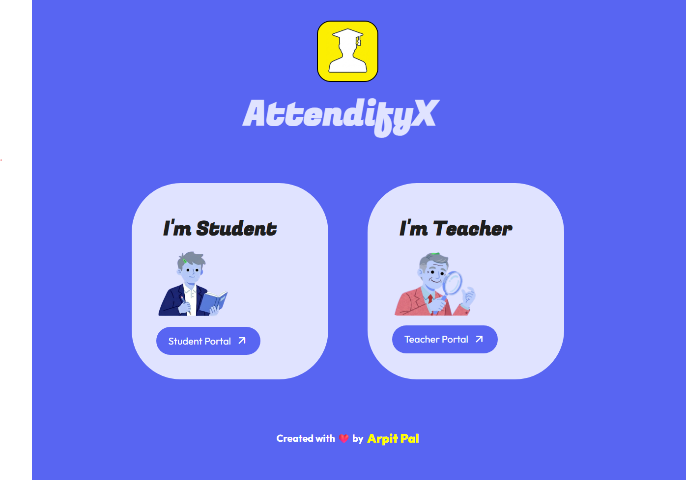

# AttendifyX: Intelligent AI Attendance System - Landing Page


This repository contains the official landing page for **AttendifyX**. It is built as a clean public-facing homepage to present the project vision, branding, core features, and product preview in a simple and professional way.

The landing page is maintained separately from the main application so the presentation layer can be deployed and updated independently.

## Live Links

- **Landing Page:** https://attendify-x-landing-page.vercel.app/
- **Main Streamlit App:** https://attendifyx-main.streamlit.app/
- **Main Project Repository:** https://github.com/AP16112/AttendifyX-Intelligent_AI_Attendance_System

## About AttendifyX

AttendifyX is an AI-powered attendance management application that automates classroom attendance using face recognition and voice recognition. It is built with `Streamlit` for the user interface, `Supabase` for backend storage, and machine learning pipelines for biometric identification.

The project is designed as a practical demonstration of how AI can be used in an education workflow to reduce manual attendance work, organize subject-wise records, and provide separate student and teacher experiences.

The full AttendifyX system is built as a Streamlit-based application, while this repository focuses only on the homepage used to showcase the project online.

## What This Repository Contains

This project is dedicated to the **home page / landing page** of AttendifyX.

It includes:

- project branding and introduction
- sticky navigation bar
- hero section with product messaging
- visual demo assets
- responsive page styling
- a lightweight Flask setup for local serving

It does **not** include the complete AI attendance application logic such as:

- biometric recognition workflows
- subject management
- attendance logging
- teacher and student dashboards
- database integration

## Features

- modern landing page layout
- branded AttendifyX homepage
- sticky navbar navigation
- demo screenshots for project presentation
- clean separation of `templates` and `static` assets
- responsive frontend structure

## Tech Stack

- HTML5
- CSS3
- Python
- Flask

## Project Structure

```text
AttendifyX - Home Page/
|-- app.py
|-- requirements.txt
|-- templates/
|   `-- index.html
|-- static/
|   |-- css/
|   |   `-- style.css
|   `-- img/
|       |-- logo.png
|       `-- demo/
`-- README.md
```

## Preview

### Landing Page



## Run Locally

1. Clone the repository:

```bash
git clone https://github.com/AP16112/AttendifyX-Landing_Page.git
cd AttendifyX-Landing_Page
```

2. Create and activate a virtual environment.

On Windows:

```bash
py -3.11 -m venv venv
venv\Scripts\activate
```

On Linux or macOS:

```bash
python3.11 -m venv venv
source venv/bin/activate
```

3. Install dependencies:

```bash
pip install -r requirements.txt
```

4. Run the project:

```bash
python app.py
```

5. Open the local server in your browser.

## Why This Landing Page Exists Separately

Keeping the landing page in its own repository makes it easier to:

- deploy the homepage independently
- manage presentation updates without affecting the main app
- keep the frontend codebase lightweight
- improve portfolio presentation and project branding

## Relation to the Main Project

This repository supports the larger **AttendifyX: Intelligent AI Attendance System** project.

The main project includes:

- face-based student login
- optional voice enrollment
- teacher attendance workflows
- subject creation and enrollment
- attendance record storage
- Supabase integration

If you want to explore the actual AI attendance system, use the main repository and Streamlit app links listed above.

## Future Improvements

- add more product sections to the homepage
- improve mobile responsiveness further
- add smoother transitions and animations
- include direct CTA buttons for GitHub and live app access
- add a footer with project and contact links
- add more screenshots from the main AttendifyX system
